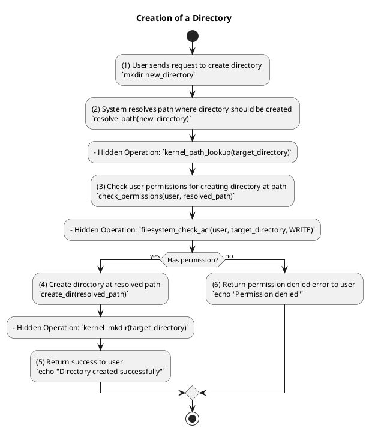
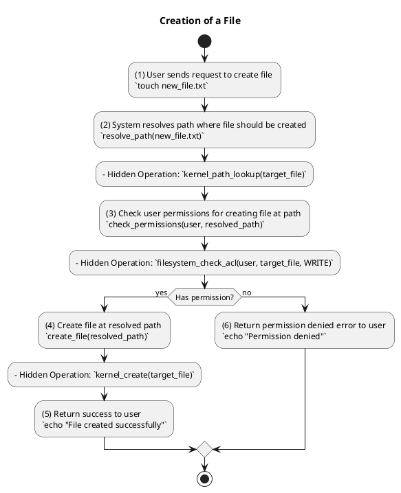
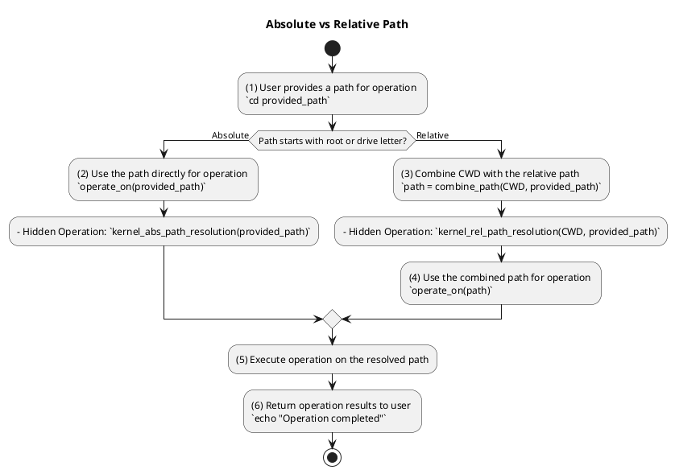

## Understanding the Current Working Directory (CWD) in Ubuntu

### 1. User Space vs. Kernel Space

Linux systems distinguish between:

- **Kernel Space**: Where the Linux kernel operates. It directly manages hardware devices, memory, and process scheduling.
- **User Space**: Where user-level applications run. They communicate with the kernel through system calls.

### 2. Shell and CWD

In Ubuntu, opening a terminal means interacting with a **shell** (often `bash`). The shell is the user's interface to the system.

- When you execute `pwd` in the terminal, it retrieves the CWD from an internal variable in the shell. Changing directories with `cd` updates this variable.

### 3. Kernel’s Role

The kernel facilitates operations related to file and directory management.

- System calls like `chdir` and `getcwd` enable changing the directory and fetching the current directory path.
  
### 4. Filesystem and inode

Each file and directory in Linux corresponds to an `inode`, which houses metadata. Directories map names to these inodes, and the kernel references inodes when navigating directories.

### 5. The `/proc` Filesystem

The `/proc` virtual filesystem offers information about processes. For instance, the CWD of a process with PID `1234` can be viewed via:

```bash
ls -l /proc/1234/cwd
```

### 6. CWD in User-Level Programs

Programs such as text editors or compilers will often default to the CWD, especially if no absolute path is designated.

### 7. Security Considerations

Ensuring a secure CWD is vital, as potential attackers might exploit relative paths to run harmful scripts or binaries.

---
Certainly! The internal or "hidden" processes usually aren't executed via terminal commands in the way users interact with a shell, but they can be thought of as operations or function calls that the kernel, filesystem, or other system components perform. Let's delve into these:

---
Certainly! Here's the content with the explanations for the hidden operations added to the right section under every scenario:

---

### Scenarios: Interactions with the CWD

#### 1. Creation of a Directory



**Explanations**:
- **(1)**: `mkdir new_directory` command in the terminal indicates user intent.
- **(2)**: System function `resolve_path(new_directory)` determines the directory's creation path.
  - **Hidden Operation**: `kernel_path_lookup(target_directory)` - The kernel confirms the validity and location of the directory path.
- **(3)**: The system checks user permissions via `check_permissions(user, resolved_path)`.
  - **Hidden Operation**: `filesystem_check_acl(user, target_directory, WRITE)` - The filesystem inspects the access control list for user write permissions on the target directory.
- **(4)**: After confirming permissions, the directory is formed using `create_dir(resolved_path)`.
  - **Hidden Operation**: `kernel_mkdir(target_directory)` - The kernel performs the directory creation operation.
- **(5)**: User receives a success message.
- **(6)**: If permissions are denied, an error message is displayed.

#### 2. Creation of a File



**Explanations**:
- **(1)**: User initiates file creation with `touch new_file.txt`.
- **(2)**: The path for file creation is ascertained using `resolve_path(new_file.txt)`.
  - **Hidden Operation**: `kernel_path_lookup(target_file)` - The kernel confirms the validity and location of the file path.
- **(3)**: User permissions are verified through `check_permissions(user, resolved_path)`.
  - **Hidden Operation**: `filesystem_check_acl(user, target_file, WRITE)` - The filesystem checks the access control list for user write permissions on the target file.
- **(4)**: Post permission validation, the file is generated using `create_file(resolved_path)`.
  - **Hidden Operation**: `kernel_create(target_file)` - The kernel performs the file creation operation.
- **(5)**: A success message is relayed to the user.
- **(6)**: In case of denied permissions, an error is displayed.

#### 3. Code differentiating between Absolute and Relative Path



**Explanations**:
- **(1)**: A user might provide a path for operations such as `cd provided_path`.
- **(2)**: For absolute paths (those starting with a root like / or a drive letter in other OS), the system will use the path directly.
  - **Hidden Operation**: `kernel_abs_path_resolution(provided_path)` - The kernel identifies and resolves absolute paths.
- **(3)**: If it's a relative path, it's combined with the CWD to form the full path.
  - **Hidden Operation**: `kernel_rel_path_resolution(CWD, provided_path)` - The kernel combines the current working directory with the relative path to determine the full path.
- **(4)**: The combined path is then used for the operation.
- **(5)**: The system executes the operation on the resolved path.
- **(6)**: Upon completion, the user receives feedback on the operation's results.

### Commands, Software, and Libraries Used:

- **Creation of a Directory**
  ```bash
  mkdir new_directory
  ```
  - Software/Library: `bash` shell (commonly used in Ubuntu).
  
- **Creation of a File**
  ```bash
  touch new_file.txt
  ```
  - Software/Library: `bash` shell.

- **Code differentiating between Absolute and Relative Path**
  ```bash
  cd provided_path
  ```
  - Software/Library: `bash` shell.

- **Visualization of the scenarios**
  - Software: `plantuml`

Note: The "hidden operations" described are abstractions and simplifications of what might occur at a lower level in the system, particularly within the kernel or filesystem. They represent conceptual actions rather than literal function names or commands.