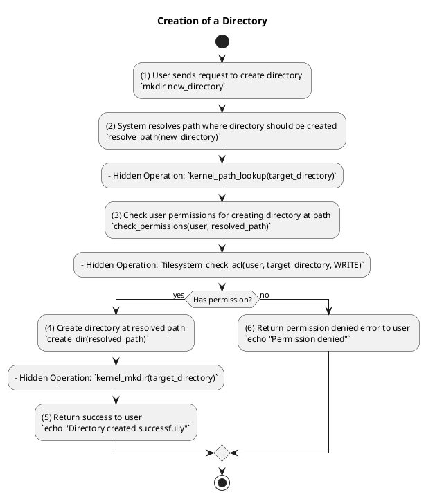
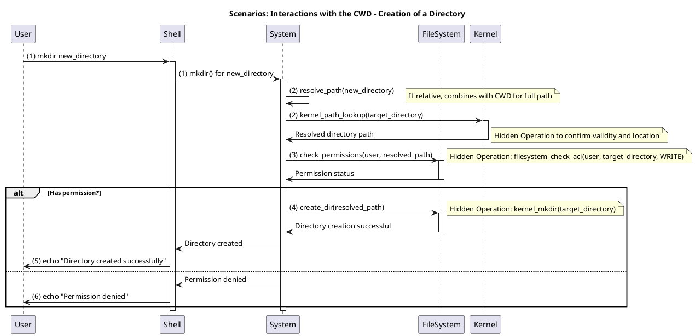
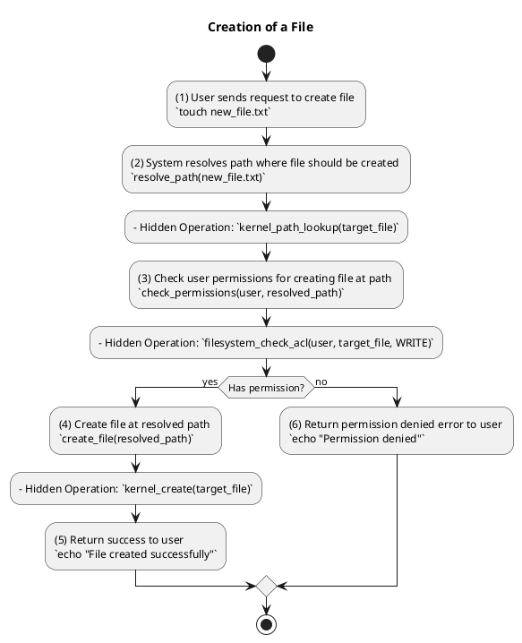
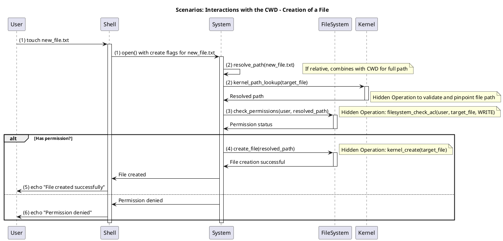
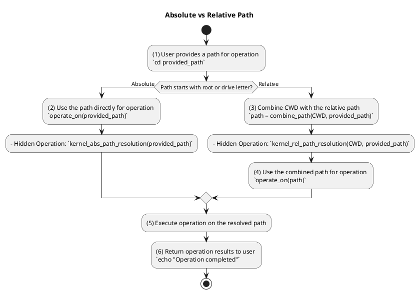
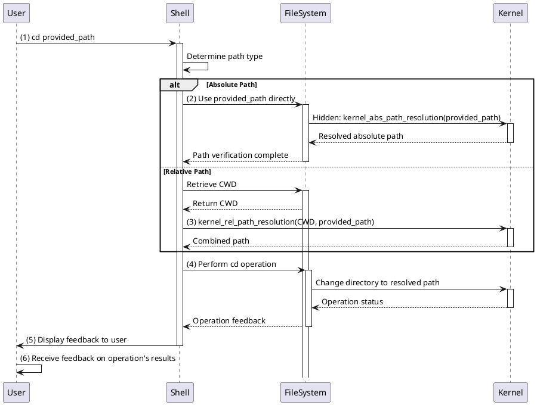

## Understanding the Current Working Directory (CWD) in Ubuntu

### 1. User Space vs. Kernel Space

Linux systems distinguish between:

- **Kernel Space**: Where the Linux kernel operates. It directly manages hardware devices, memory, and process scheduling.
- **User Space**: Where user-level applications run. They communicate with the kernel through system calls.

### 2. Shell and CWD

In Ubuntu, opening a terminal means interacting with a **shell** (often `bash`). The shell is the user's interface to the system.

- When you execute `pwd` in the terminal, it retrieves the CWD from an internal variable in the shell. Changing directories with `cd` updates this variable.

### 3. Kernel’s Role

The kernel facilitates operations related to file and directory management.

- System calls like `chdir` and `getcwd` enable changing the directory and fetching the current directory path.
  
### 4. Filesystem and inode

Each file and directory in Linux corresponds to an `inode`, which houses metadata. Directories map names to these inodes, and the kernel references inodes when navigating directories.

### 5. The `/proc` Filesystem

The `/proc` virtual filesystem offers information about processes. For instance, the CWD of a process with PID `1234` can be viewed via:

```bash
ls -l /proc/1234/cwd
```

### 6. CWD in User-Level Programs

Programs such as text editors or compilers will often default to the CWD, especially if no absolute path is designated.

### 7. Security Considerations

Ensuring a secure CWD is vital, as potential attackers might exploit relative paths to run harmful scripts or binaries.

### Scenarios: Interactions with the CWD

#### 1. Creation of a Directory





---

### Scenarios: Interactions with the CWD

#### 1. Creation of a Directory

**Command**:
```bash
mkdir new_directory
```

**Steps**:

##### 1.1. User sends request to create directory
- The shell interprets the `mkdir` command.
- A system call, `mkdir()`, is invoked by the shell.
  
**Explanations**:
- **(1)**: `mkdir new_directory` command in the terminal indicates user intent. This operation is dependent on the CWD if an absolute path is not specified.
  
##### 1.2. System resolves path where directory should be created
- The kernel performs a path lookup using functions such as `lookup_one_len()`.
- If a relative path is given, the kernel combines the CWD with the provided directory name to resolve the full path.
- Function: `resolve_path(new_directory)`

**Explanations**:
- **(1)**: `mkdir new_directory` command in the terminal indicates user intent.
- **(2)**: System function `resolve_path(new_directory)` determines the directory's creation path using the CWD as a base for relative paths.
  - **Hidden Operation**: `kernel_path_lookup(target_directory)` - The kernel confirms the validity and location of the directory path using the CWD.
- **(3)**: The system checks user permissions via `check_permissions(user, resolved_path)`.
  - **Hidden Operation**: `filesystem_check_acl(user, target_directory, WRITE)` - The filesystem inspects the access control list for user write permissions on the target directory.
- **(4)**: After confirming permissions, the directory is formed using `create_dir(resolved_path)`.
  - **Hidden Operation**: `kernel_mkdir(target_directory)` - The kernel performs the directory creation operation using the information derived from the CWD.
- **(5)**: User receives a success message.
- **(6)**: If permissions are denied, an error message is displayed. 

---


#### 2. Creation of a File





---

### Scenarios: Interactions with the CWD

#### 2. Creation of a File

**Command**:
```bash
touch new_file.txt
```

**Steps**:

##### 2.1. User sends request to create file
- The shell interprets the `touch` command.
- A system call related to file creation, e.g., `open()`, is invoked by the shell with specific flags to create the file if it doesn't exist.
  
**Explanations**:
- **(1)**: User initiates file creation with `touch new_file.txt`. This operation often relies on the CWD if an absolute path isn't provided.
  
##### 2.2. System establishes the path for file creation
- If a relative path is indicated, the system combines the CWD with the provided file name to determine the full path.
- Function: `resolve_path(new_file.txt)`

**Explanations**:
- **(1)**: User initiates file creation with `touch new_file.txt`.
- **(2)**: The path for file creation is ascertained using `resolve_path(new_file.txt)`. If a relative path is given, the system uses the CWD as a base to determine the full path.
  - **Hidden Operation**: `kernel_path_lookup(target_file)` - The kernel validates and pinpoints the file path, taking into account the CWD for relative paths.
- **(3)**: User permissions are verified through `check_permissions(user, resolved_path)`.
  - **Hidden Operation**: `filesystem_check_acl(user, target_file, WRITE)` - The filesystem verifies the access control list to determine user write permissions on the intended file.
- **(4)**: After the permissions are validated, the file is generated using `create_file(resolved_path)`.
  - **Hidden Operation**: `kernel_create(target_file)` - The kernel carries out the file creation operation using the details obtained from the CWD.
- **(5)**: A success message is communicated to the user.
- **(6)**: If permissions are denied, an error message is presented.

---


#### 3. Code differentiating between Absolute and Relative Path





---

### Scenarios: Changing Directories using the CWD

#### 3. Navigating Directories

**Command**:
```bash
cd provided_path
```

**Steps**:

##### 3.1. User expresses intention to change directory
- The shell processes the `cd` command.
- Depending on the path's nature (absolute or relative), the system will take different actions to resolve it.
  
**Explanations**:
- **(1)**: A user expresses their intent to change the directory, often relying on the CWD if they haven't provided an absolute path. The command in action: `cd provided_path`.

##### 3.2. System determines the nature of the provided path
- If the path begins with a root marker like '/', it's treated as an absolute path.
- Conversely, without such markers, the path is treated as relative, and the system will refer to the CWD to decipher the full directory path.

**Explanations**:
- **(1)**: A user provides a path for operations like `cd provided_path`.
- **(2)**: For absolute paths (those starting with root markers such as '/'), the system utilizes the path as it is.
  - **Hidden Operation**: `kernel_abs_path_resolution(provided_path)` - The kernel processes and resolves the absolute paths directly without any need for the CWD.
- **(3)**: If a relative path is entered, it gets combined with the CWD to yield the complete path.
  - **Hidden Operation**: `kernel_rel_path_resolution(CWD, provided_path)` - Using the current working directory as a reference, the kernel fuses it with the relative path to establish the full directory path.
  
##### 3.3. Execution and Feedback
- Using the resolved path, the system enacts the directory change.
- After the operation's success or failure, the user is given an update.

**Explanations**:
- **(4)**: With the determined path (whether direct or combined with CWD), it becomes the basis for the directory change operation.
- **(5)**: The system activates the operation on the ascertained path.
- **(6)**: After finalizing the operation, feedback is rendered to the user, illuminating the outcome.

---


### Commands, Software, and Libraries Used:

- **Creation of a Directory**
  ```bash
  mkdir new_directory
  ```
  - Software/Library: `bash` shell (commonly used in Ubuntu).
  
- **Creation of a File**
  ```bash
  touch new_file.txt
  ```
  - Software/Library: `bash` shell.

- **Code differentiating between Absolute and Relative Path**
  ```bash
  cd provided_path
  ```
  - Software/Library: `bash` shell.

- **Visualization of the scenarios**
  - Software: `plantuml`

